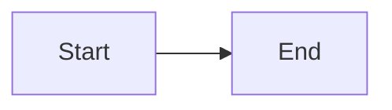

<!--
// objective: test mermaid fenced code blocks in markdown
// check: md_119__mermaid__markdown.xml
// config: MERMAID_RENDER_MODE=CLIENT_SIDE
-->
# Mermaid Markdown Test

Text before diagram.

Text after diagram.
